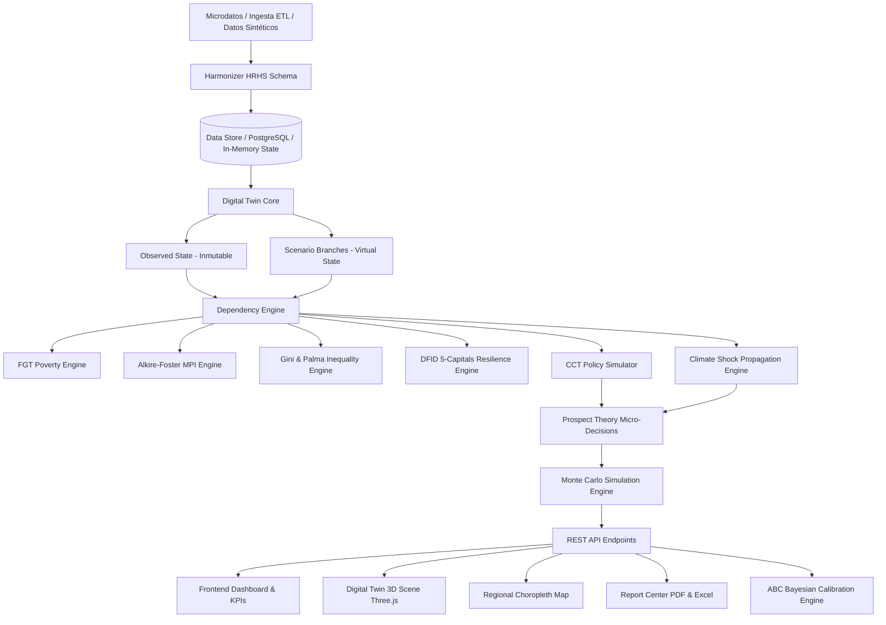

# Arquitectura del Sistema DLT (Digital Livelihood Twin)

## Capas del Sistema

### 1. Capa de Datos & ETL
- Ingesta y normalización en el esquema **Harmonized Rural Household Schema (HRHS)**.
- Generador de datos sintéticos calibrado para distribuciones log-normales de ingreso, composición demográfica, características agrícolas y zonificación agroecológica.

### 2. Capa del Gemelo Digital (Digital Twin Core)
- **Estado Observado**: Inmutable, representa la fotografía empírica o de línea base.
- **Ramas de Escenario**: Contrafactuales creados bajo intervenciones de CCT o choques climáticos.
- **Dependency Engine**: Grafo acíclico dirigido (DAG) que recalcula en cascada:
  $$\Delta \text{Income} \longrightarrow \Delta \text{PerCapita} \longrightarrow \Delta \text{FGT} \longrightarrow \Delta \text{MPI} \longrightarrow \Delta \text{Resilience}$$

### 3. Capa de Modelado y Simulación
- **CCT Engine**: 4 escenarios canónicos (Universal, Focalizado Condicional, Progresivo Graduado, Integrado Productivo).
- **Climate Engine**: Degradación de rendimientos agrícolas ante sequías, heladas o precipitaciones extremas.
- **Prospect Theory Engine**: Decisiones de ahorro precautorio y consumo bajo aversión a la pérdida ($\lambda = 2.25$).
- **Monte Carlo ABM**: Simulación temporal de 12 a 36 meses con intervalos de confianza de percentiles 5, 50 y 95.

### 4. Capa de Presentación e Interacción
- **Dashboard Analítico**: Visualización en tiempo real de curvas de Lorenz, distribuciones de ingreso e indicadores macro.
- **Twin Explorer**: Ficha detallada de 5 capitales, composición familiar y vulnerabilidad climática.
- **Laboratorio 3D**: Terreno procedural interactivo con cultivos reactivos a estrés hídrico.
- **Laboratorio What-If**: Modificación de variables con recálculo en tiempo real (< 10 ms).
- **Report Center**: Generación nativa de reportes en PDF y hojas de cálculo Excel multisección.
